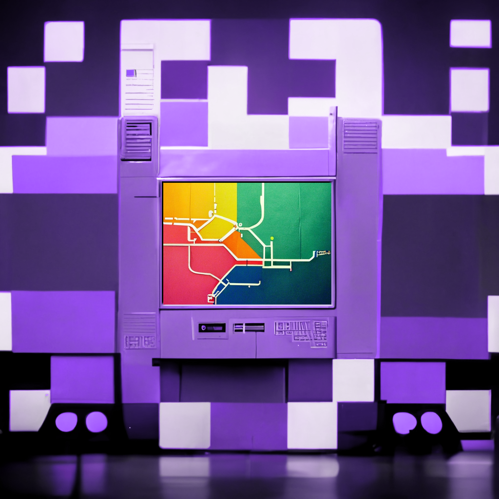
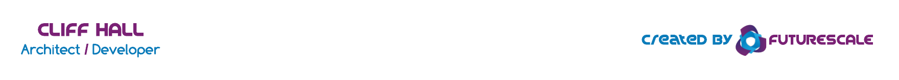

# Building with the Fismo SDK
[Fismo](https://github.com/cliffhall/Fismo) machines are a way of simulating processes, branching narratives, maps of places, or nearly any stateful thing you can imagine. This project explores ways of using Fismo to build cool things.

One of your machines, installed in a clone of our machine. Created by another machine, using [Midjourney](https://twitter.com/midjourney). 🤖

## 📖 [SDK Documentation](https://docs.fismo.xyz/dev/sdk.html)
## 🗄 [Fismo Protocol Source](https://github.com/cliffhall/Fismo)
## 📋 Status
###  🔬 

Done or in progress are:
* ✅ Project structure
* ✅ Backlink from SDK docs
* ✅ Using Fismo NPM package
* Write scripts for Node.js
  * ✅ Clone a Fismo instance on a supported chain
  * ✅ Install machines and optionally initialize storage
  * 👉 Add new states and transitions to installed machines
* Write HTML/JS
  * ✅ Prove self-validating entities are present and usable
  * 👉 Invoke actions on machines
  * 👉 Query a user's current state, last position, and position history
* Lab experiment topics
  * ✅ Token-gated state transitions
  * ✅ Machine-specific storage slots
  * ✅ Guard contract initializers
  * 👉 Self-targeting state transitions
* Projects
  * 👉 Small game utilizing [existing NFTs and lore](https://opensea.io/collection/alch)
  * 👉 "How to" doc with game as subject
  
##  