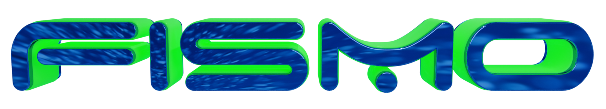
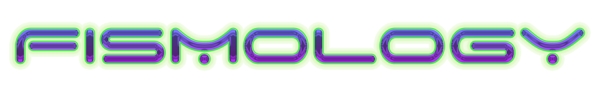

# Building with the Fismo SDK
Fismo Machines are a way of simulating processes, branching narratives, maps of places, or nearly any stateful thing you can imagine. This project explores ways of using Fismo to build cool things.

This machine, a representation of one of your machines, installed in your instance of our machine, was created by another machine using [Midjourney](https://twitter.com/midjourney).

## 📖 [Documentation](https://docs.fismo.xyz/dev/sdk.html)
## 📋 Status
###  🔬 

Done or in progress are:
- ✅ Initial project structure
- 👉 Standalone demo project using SDK only
- 👉 "How to" doc with demo as subject

##  