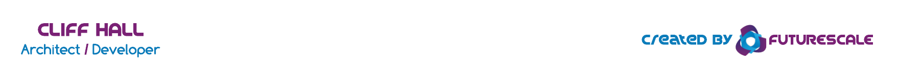

# Building With the Fismo SDK
#### Working in the Fismology Lab
> _When you have a hammer, everything looks like a nail. When you have Fismo, everything looks like a state machine._

[Fismo](https://github.com/cliffhall/Fismo) machines are a way of simulating processes, branching narratives, maps of places, or nearly any stateful thing you can imagine.

There is no specific set of steps for integrating Fismo into your project. It could be the core component around which the whole architecture hangs. Or it could just model a minor stateful mechanism in a much larger ecosystem of contracts.

The Fismology Lab has been established as a place where we can explore the possibilities, create some useful tools, and realize Fismo's potential together.

#### Lab Experiments
  * 🧪 _Lockable Door_ - Representing a Physical System
    * 💥 **[Try it now!](experiment/lockable-door.html)**
    * 📋 _Exercises the following Fismo features:_
      * ✅ Contextually suppressed actions
      * ✅ Machine-specific storage slot
      * ✅ Guarded state transitions
      * ✅ Machine initializers
      * ✅ Machine metadata

##  